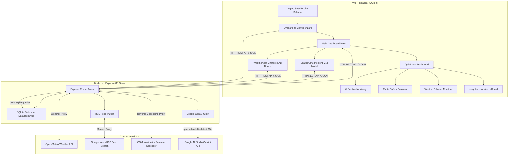

# MonsoonMind Preparedness Platform

MonsoonMind is a production-ready, highly interactive, and responsive web application designed to help individuals, families, and communities prepare for, navigate, and recover from severe monsoon weather events.

---

## System Architecture Diagram

---

## Technology Stack

*   **Frontend**: React.js, Tailwind CSS (Tailwind v4 with `@tailwindcss/postcss`), Leaflet.js (OpenStreetMap tile layers mapping).
*   **Backend**: Node.js, Express framework, `rss-parser` (RSS news aggregator).
*   **Database**: SQLite native engine via Node's built-in `node:sqlite` (`DatabaseSync` - zero external compilation requirements).
*   **Generative AI**: Google Gen AI SDK (`@google/genai`) running on the **`gemini-flash-lite-latest`** model.

---

## Core Features & Real-Time Functionality

### 1. Dynamic Ingestion Pipelines
*   **Real-Time Weather Feed**: Proxies requests to the keyless Open-Meteo API using active coordinate queries (`/api/weather`) to retrieve precipitation rates (mm/hr), temperatures, and alert statuses.
*   **Localized Bulletins (RSS)**: Dynamically queries and parses Google News search results (`/api/news`) using search query strings matching the user's active neighborhood location, displaying bulletins directly in the dashboard.
*   **Reverse Geocoding Proxy**: Resolves GPS coordinates to city or neighborhood names in real-time via OpenStreetMap's Nominatim Reverse Geocoding API (`/api/reverse-geocode`), updating the UI header to show **`GPS: [City Name]`**.

### 2. User Onboarding & Pre-Seeded Profiles
*   **5 Indian Seed Profiles**: Wipes and seeds exactly 5 profiles matching target regions upon initialization:
    1.  *Rajesh Kulkarni* (Kurla, Mumbai)
    2.  *Tsering Dorjee* (Munnar, Kerala)
    3.  *Ananya Chatterjee* (New Town, Kolkata)
    4.  *K. Srinivasan* (Velachery, Chennai)
    5.  *Preeti Sharma* (Sector 48, Gurugram)
*   **Onboarding Wizard**: Multi-step onboarding panel capturing:
    *   *Step 1*: User name, language native pills, and text location.
    *   *Step 2*: Detailed household demographics counter (adults, kids, elderly, mobility assistance, pets).
    *   *Step 3*: Dwelling infrastructure (ground floor chawls/villas, apartment levels, commute vehicles, sump pump, power backups).
*   **Database Integration**: New registrations are stored dynamically in the SQLite database and set as the active profile context.

### 3. Context-Aware AI Preparedness (Module A)
*   **Zone-Split Prompting**: Updates safety checklists based on the active location mode:
    *   *Home Zone*: Generates checklist items focused specifically on home dwelling parameters (sump pumps, backups, chawl blockages).
    *   *Live GPS Zone*: Focuses strictly on outdoor transit safety, travel shielding, and immediate flash flooding precautions, ignoring home infrastructure.
*   **Multilingual Support**: Supports 6 languages (English, Hindi, Marathi, Tamil, Bengali, Malayalam) with immediate dashboard translation.

### 4. Travel Route Advisory (Module B)
*   Allows users to type origin and destination locations.
*   Inspects active database incidents along the path.
*   Calls Gemini to evaluate travel safety status (`Safe`, `Caution`, `Unsafe`), generating warning summaries and alternative transit advice.

### 5. Community Incident Reporting
*   Users click a red warning button to open a Leaflet map.
*   A draggable map marker snaps to coordinates on click, allowing users to report severe waterlogging, blockages, landslides, or power outages.
*   Reports write to the database and update the advisory context for all nearby users (within ~25km).

### 6. WeatherMan Chatbot FAB
*   Persistently floats in the lower-right corner.
*   Adapts to user input queries in real time. If a user queries in Hindi, Marathi, etc., the bot replies in that language, defaulting to the profile's default language.
